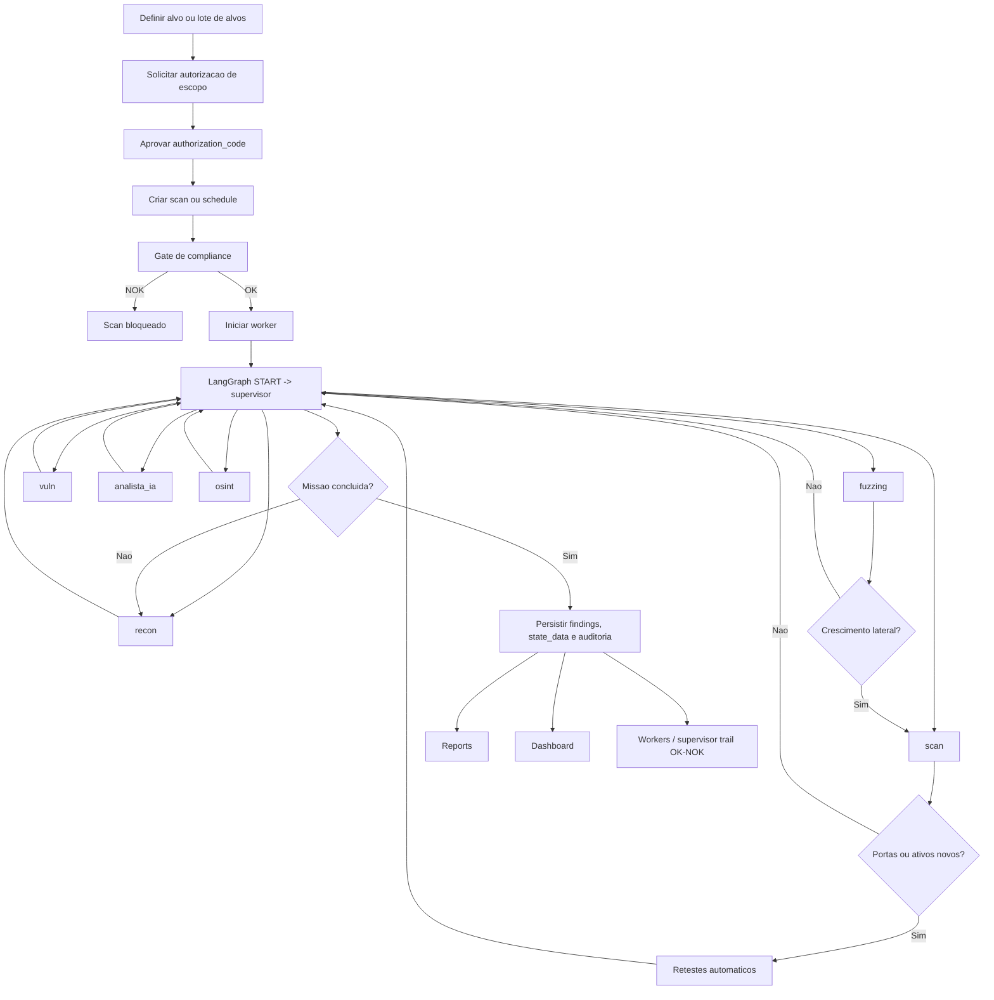

# VALID ASM - Guia Operacional

VALID ASM (vASM) e uma plataforma de External Attack Surface Management voltada para uso defensivo e autorizado. A aplicacao centraliza descoberta, triagem, priorizacao e monitoramento da superficie externa com trilha de auditoria, compliance e visao operacional em dashboard e relatorios.

## Aviso de seguranca

Este projeto foi estruturado para uso defensivo e autorizado. Toda execucao depende de autorizacao valida por escopo e de policy/allowlist ativa para o cliente.

## Estado atual da aplicacao

O repositorio implementa hoje:

- backend FastAPI com persistencia em PostgreSQL;
- workers Celery separados por modo unitario e agendado;
- grafo LangGraph com supervisor explicito;
- nodos especializados de recon, scan, fuzzing, vuln, analista_ia e osint;
- logs em tempo real por WebSocket;
- findings persistidos com enriquecimento CVE/CVSS/KEV;
- recomendacoes IA em portugues;
- dashboard com FAIR + AGE;
- paginacao server-side para findings e acoes priorizadas;
- validacao da trilha do supervisor com status OK/NOK.

## Arquitetura operacional

- Backend: FastAPI
- Orquestracao async: Celery + Redis
- Persistencia principal: PostgreSQL
- Grafo de execucao: LangGraph StateGraph
- Checkpointer: PostgreSQL com fallback MemorySaver
- IA local: Ollama via HTTP
- Memoria vetorial para falsos positivos: ChromaDB
- Frontend: React + Tailwind + Vite

## Perfis e acesso

- Administrador:
  - cria scans e agendamentos;
  - solicita e aprova autorizacoes;
  - ajusta runtime, tools, workers, allowlist e grupos;
  - consulta auditoria, jobs e health.
- Usuario:
  - acessa dashboard, reports, targets, assets, vulnerabilities e issues;
  - nao altera configuracao nem dispara scans.

## Fluxo ponta a ponta

### Resumo operacional

1. O usuario/admin define um alvo unico ou um conjunto de alvos para agendamento.
2. O admin solicita autorizacao com prova de ownership e recebe um authorization_code.
3. O admin aprova a autorizacao.
4. O backend valida autorizacao e policy/allowlist antes de qualquer execucao.
5. O worker inicia o LangGraph e entra sempre pelo nodo supervisor.
6. O supervisor roteia os nodos especialistas em ciclo: recon, scan, fuzzing, vuln, analista_ia e osint conforme o estado.
7. O scan registra portas e retestes; o fuzzing pode descobrir ativos laterais; o osint faz enriquecimento externo.
8. Achados sao persistidos como findings, com recomendacoes IA e enrichment CVE/CVSS/KEV quando houver correlacao.
9. Dashboard, Reports, Workers e demais telas leem apenas dados persistidos.

### Diagrama completo



## Guia operacional por etapa

### 1. Subir a stack

Desenvolvimento:

```bash
cp .env.example .env
docker compose --profile dev up --build
```

Producao:

```bash
cp .env.example .env
docker compose --profile prod up --build -d
```

Acessos padrao:

- Frontend: http://localhost:5173
- Backend: http://localhost:8000
- Health: http://localhost:8000/health

### 2. Autorizar o escopo

Fluxo minimo:

1. POST /api/compliance/authorizations/request
2. PUT /api/compliance/authorizations/{authorization_id}/approve
3. usar o authorization_code aprovado na criacao de scan ou schedule.

Sem esse passo, o scan fica bloqueado por compliance.

### 3. Criar scan unitario

- Endpoint: POST /api/scans
- Uso: execucao pontual de um alvo especifico.
- Filas envolvidas:
  - scan.unit
  - worker.unit.recon
  - worker.unit.crawler
  - worker.unit.fuzzing
  - worker.unit.vuln
  - worker.unit.code_js
  - worker.unit.api
  - worker.unit.osint

### 4. Criar agendamento

- Endpoint: POST /api/schedules
- O agendamento persiste:
  - targets_text
  - frequency
  - run_time
  - day_of_week
  - day_of_month

Estado real atual da stack:

- o modelo de agendamento existe;
- a execucao manual existe via POST /api/schedules/{schedule_id}/execute;
- o docker-compose.yml atual nao sobe um scheduler automatico tipo Celery Beat.

Em outras palavras: hoje o schedule e persistido e executado sob demanda, nao automaticamente por cron interno da stack.

### 5. Monitorar a execucao

Durante a execucao, acompanhe:

- status do scan: GET /api/scans/{scan_id}/status
- logs do scan: GET /api/scans/{scan_id}/logs
- logs em tempo real: GET ws://<host>/ws/scans/{scan_id}/logs?token=<jwt>
- health dos workers: GET /api/worker-manager/health
- metricas de interacao: GET /api/worker-manager/overview
- validacao da trilha do supervisor: GET /api/worker-manager/supervisor-trail

### 6. Consumir a saida operacional

Depois da execucao:

- report do scan: GET /api/scans/{scan_id}/report
- dashboard consolidado: GET /api/dashboard/insights
- findings paginados: GET /api/findings/page
- inventario de targets: GET /api/targets/summary
- inventario de assets: GET /api/assets
- registry de jobs: GET /api/jobs/registry

## Grafo de execucao

Estado principal do AgentState:

- lista_ativos
- logs_terminais
- vulnerabilidades_encontradas
- proxima_ferramenta
- mission_index
- mission_items
- activity_metrics
- node_history

Nodos atuais:

- SupervisorNode
- ReconNode
- ScanNode
- FuzzingNode
- VulnNode
- AnalistaIANode
- OSINTNode

Regras do fluxo:

- a entrada sempre ocorre no SupervisorNode;
- o supervisor decide o proximo worker pelo campo proxima_ferramenta;
- todo worker retorna para o supervisor;
- node_history registra a trilha de transicoes;
- a trilha e validada para classificar cada scan como OK ou NOK no endpoint de supervisor trail.

## Tabelas e telas operacionais

Telas principais do frontend:

- Dashboard
- Targets
- Assets
- Vulnerabilities
- Issues
- Reports
- Scans
- Schedules
- Settings
- Tools
- Workers
- Jobs Registry

As telas operacionais leem dados persistidos do banco. O frontend nao inventa estado paralelo para findings, dashboard ou relatorios.

## Endpoints principais

Autenticacao:

- POST /api/auth/register
- POST /api/auth/login
- POST /api/auth/refresh
- GET /api/auth/me

Scans e resultados:

- POST /api/scans
- GET /api/scans
- GET /api/scans/{scan_id}/status
- GET /api/scans/{scan_id}/logs
- GET /api/scans/{scan_id}/report
- GET /api/findings
- GET /api/findings/page
- POST /api/findings/{finding_id}/false-positive

Inventario e dashboard:

- GET /api/dashboard
- GET /api/dashboard/insights
- GET /api/targets/summary
- GET /api/assets
- GET /api/jobs/registry

Compliance e auditoria:

- POST /api/compliance/authorizations/request
- GET /api/compliance/authorizations
- PUT /api/compliance/authorizations/{authorization_id}/approve
- PUT /api/compliance/authorizations/{authorization_id}/revoke
- GET /api/audit/events

Workers e operacao:

- GET /api/worker-manager/groups
- GET /api/worker-manager/overview
- GET /api/worker-manager/health
- GET /api/worker-manager/supervisor-trail
- POST /api/worker-manager/requeue-orphans

Configuracao e policy:

- GET /api/config/runtime
- PUT /api/config/runtime
- GET /api/config/ai-status
- GET /api/config/tools
- GET /api/config/nessus
- PUT /api/config/nessus
- GET /api/policy/allowlist
- POST /api/policy/allowlist
- PUT /api/policy/allowlist/{entry_id}
- DELETE /api/policy/allowlist/{entry_id}

Agendamentos:

- GET /api/schedules
- POST /api/schedules
- PUT /api/schedules/{schedule_id}
- DELETE /api/schedules/{schedule_id}
- POST /api/schedules/{schedule_id}/execute

## Validacao da stack declarada

### Docker Compose

Validacao estatica realizada:

- docker-compose.yml sem erro de sintaxe;
- separacao correta entre perfis dev e prod;
- filas declaradas dos workers estao alinhadas com backend/app/workers/worker_groups.py e backend/app/workers/tasks.py;
- frontend_prod usa npm run preview, e o script existe em frontend/package.json.

Observacao operacional importante:

- nao existe servico de scheduler automatico no compose atual;
- portanto, agendamentos nao rodam automaticamente apenas por frequency/run_time;
- a execucao atual de agendamentos e manual via endpoint POST /api/schedules/{schedule_id}/execute.

### Requirements do backend

Validacao do uso real do codigo:

- pytest estava faltando, apesar de ja existirem testes em backend/tests;
- python-multipart nao esta em uso no backend atual;
- langchain-community nao esta sendo importado no codigo atual;
- ollama como pacote Python nao esta em uso porque a integracao atual com Ollama e feita via httpx.

Ajuste aplicado em backend/requirements.txt:

- adicionado pytest==8.3.5;
- removidos python-multipart, langchain-community e ollama.

Dependencias que permanecem coerentes com o codigo:

- fastapi
- uvicorn[standard]
- sqlalchemy
- psycopg2-binary
- alembic
- pydantic-settings
- python-jose[cryptography]
- passlib[bcrypt]
- celery
- redis
- langgraph
- langgraph-checkpoint-postgres
- chromadb
- httpx
- pynessus

## Estrutura principal

- [docker-compose.yml](docker-compose.yml)
- [backend/Dockerfile](backend/Dockerfile)
- [backend/requirements.txt](backend/requirements.txt)
- [backend/app/main.py](backend/app/main.py)
- [backend/app/graph/workflow.py](backend/app/graph/workflow.py)
- [backend/app/workers/tasks.py](backend/app/workers/tasks.py)
- [backend/app/workers/worker_groups.py](backend/app/workers/worker_groups.py)
- [backend/app/api/routes_scans.py](backend/app/api/routes_scans.py)
- [backend/app/api/routes_management.py](backend/app/api/routes_management.py)
- [frontend/src/App.jsx](frontend/src/App.jsx)
- [frontend/src/pages](frontend/src/pages)

## Validacao automatizada disponivel

Fluxo E2E:

```bash
python scripts/validate_e2e_flow.py
```

Arquivo:

- [scripts/validate_e2e_flow.py](scripts/validate_e2e_flow.py)

Runbook:

- [docs/RUNBOOK.md](docs/RUNBOOK.md)
