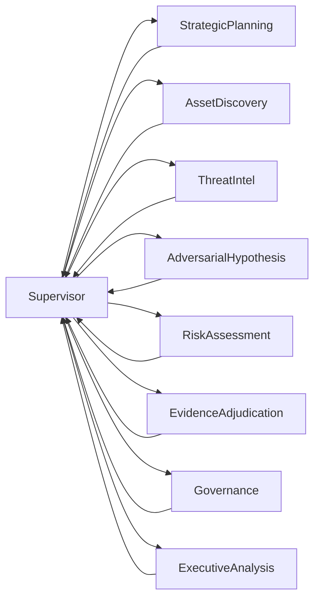

# Senior Cyber Analyst Framework (LangGraph)

Este documento define o novo contrato operacional do agente de pentest do PENTEST.IO.

## Objetivo

Elevar o comportamento do agente para um perfil de analista cyber senior:
- orientado por hipótese
- orientado por evidência
- orientado por decisão baseada em confiança

## Fluxo LangGraph (v2)

Arquitetura supervisor-centric com single decision maker.

Capacidades disponíveis:

1. StrategicPlanning
2. AssetDiscovery
3. ThreatIntel
4. AdversarialHypothesis
5. RiskAssessment
6. EvidenceAdjudication
7. Governance
8. ExecutiveAnalysis

O supervisor escolhe dinamicamente qual capacidade rodar com base em confiança,
evidência e orçamento de iterações.

### Diagrama

## Contratos de Estado (State Contracts)

Os contratos abaixo foram adicionados ao estado compartilhado do grafo:

- `analyst_framework`
- `operation_plan`
- `confidence_state`
- `evidence_contract`

### analyst_framework

Define o framework ativo:
- `name`: identificador da metodologia
- `version`: versao da metodologia
- `loop`: ciclo de raciocinio (know, think, test, validate)
- `confidence_thresholds`: limites de confianca

### operation_plan

Plano formal por fases:
- `objective`
- `current_phase`
- `total_phases`
- `phases[]`: lista com `id`, `title`, `status`

### confidence_state

Estado metacognitivo de decisao:
- `global_confidence`
- `reason`
- `last_updated`
- `hypothesis` (quando aplicavel)

### evidence_contract

Regras de promocao de achados:
- `critical_requires`
- `high_requires`
- `minimum_confidence_for_promote`
- `status_values`: `hypothesis`, `unverified`, `verified`

## Regras de Decisao

### Thresholds

- Alta confianca: >= 80
- Media confianca: 50-79
- Baixa confianca: < 50

### Adjudicacao de Evidencia

- Finding `critical/high` com confianca abaixo do threshold minimo nao e promovido para comprovado.
- O status deve ser degradado para `hypothesis` quando faltar prova suficiente.

## Compatibilidade

A refatoracao preserva os artefatos principais consumidos pela plataforma:
- `vulnerabilidades_encontradas`
- `easm_rating`
- `fair_decomposition`
- `executive_summary`
- `mission_items`, `mission_index`, `node_history`

## Resultado Esperado

Com esse desenho, o agente deixa de ser apenas pipeline de ferramentas e passa a ser um sistema de analise com governanca de decisao e prova, alinhado a benchmark de avaliacao mais exigente.
